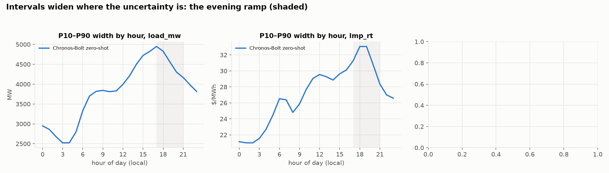

# CAISO Day-Ahead Forecaster — with a live, graded track record

**Live scoreboard:** `site/index.html` (GitHub Pages needs the repo to be public on the current plan; the daily Action in `ops/github-workflow-daily.yml` deploys it once enabled) · **Forecast files:** [`forecasts/`](forecasts/) (committed with issue timestamps before each operating day) · **Graded record:** [`data/live/track_record.csv`](data/live/track_record.csv)

Every morning a job trains on all complete days, writes tomorrow's 24-hour SP15 load & price forecast to the repo *before* the
day-ahead market clears, grades yesterday's file against actuals, and regenerates the scoreboard. The baseline that counts is
**CAISO's own published day-ahead load forecast**; for price, the day-ahead LMP (the market's own forecast of real time).

## The tournament (walk-forward, 2024-07-01 → 2026-09-06, 798 days, identical splits) — [`docs/scoreboard.md`](docs/scoreboard.md)

| target | **LightGBM (ours)** | incumbent | seasonal-naive | Chronos-Bolt zero-shot |
|---|---|---|---|---|
| Load MAE, all hours | 729 MW (2.9 %) | **CAISO 512 MW (2.1 %)** | 1,892 | 1,202 |
| Load MAE, severe-price hours | 3,065 | **1,414** | 5,191 | 3,237 |
| RT LMP MAE, all hours | $9.9 | **DA LMP $7.2** | $14.2 | $9.8 |
| RT LMP MAE, severe hours | $112 | $147 | $113 | **$106** |
| DA LMP MAE | **$5.1** | — | $8.7 | $6.8 |
| Battery: % of perfect-foresight value | 83.8 % | **86.9 %** | 77.9 % | 85.6 % |

**The spike finding in one sentence:** every history-based forecast — ours, the foundation model, and the market's own day-ahead price —
under-forecasts severe real-time hours by $50–80 of bias, and the only component that reacts is a separate evening-spike classifier
(AUC 0.88, precision 0.62 / recall 0.55 at p ≥ 0.5) built on forecast weather, renewables and net-load ramp rather than price history.

**The honest verdict:** we beat every naive baseline and the zero-shot foundation model on load and day-ahead price, and we do **not**
beat CAISO on load or the day-ahead LMP on real-time price. Honest weather inputs cost ~8 % of load MAE (strict 729 → observed-weather 670).




## Post-mortems · model card · decisions
- [2024-09-05 — heat-wave peak, 47.3 GW record](docs/postmortems/2024-09-05.md): trees can't extrapolate; 6.6 GW low at the peak.
- [2026-06-20 — negative net-load Saturday, −8.9 GW](docs/postmortems/2026-06-20.md): the forecasts were right; the product is net load.
- [2026-03-20 — low-wind evening ramp, RT $1,188](docs/postmortems/2026-03-20.md): nobody priced it; a 28 GW net-load swing in six hours.
- [Model card](docs/model_card.md) · [Design decisions & what I'd do differently](docs/design_decisions.md) · [Calibration](docs/calibration.md) · [Spike layer](docs/spike.md) · [Battery](docs/battery.md) · [Baselines](docs/baselines.md) · [EDA](docs/eda.md) · [Features & leak notes](docs/features.md) · [Data notes & traps](docs/data_notes.md)

---

## Architecture

```
data.py        pull + cache 12 sources (CAISO Outlook, OASIS, Open-Meteo previous-runs/archive), midnight-aligned chunking,
               UTC-keyed hourly join, validated by validate.py (64 checks: row counts, DST days, gaps, cross-source consistency)
features.py    92 leak-free features as of 09:00 D-1; three weather variants (strict / lenient / observed) for the leakage ablation
models.py      LightGBM point + quantile (one global model per target); Chronos-Bolt zero-shot (separate process)
backtest.py    expanding-window walk-forward, retrain every 14 days, forecasts stored long (model, target, ts, p10/p50/p90)
tournament.py  one scoreboard; metrics.py is the only scoring code     calibration.py  coverage, PIT, pinball, per-hour conformal bands
spike.py       evening-spike classifier + failure analysis            battery.py      LP-scheduled 4 h battery, settled at RT, risk frontier
live.py        daily: update tail → forecast D → grade D-1 → site + briefing (template over the forecast file's numbers only)
```

### Reproduce
```
brew install libomp && uv venv -p 3.12 && uv pip install -e ".[dev]" chronos-forecasting torch
python scripts/pull_data.py                                   # ~45 min first time; cached per source afterwards
PYTHONPATH=src python -m caiso_forecast.validate              # Phase 1 gate: must pass before anything else
PYTHONPATH=src python -m caiso_forecast.eda && python -m caiso_forecast.baselines && python -m caiso_forecast.features
PYTHONPATH=src python -m caiso_forecast.backtest --models gbm            # ~70 min
PYTHONPATH=src python -m caiso_forecast.backtest --models chronos        # ~3 min, separate process on purpose
PYTHONPATH=src python -m caiso_forecast.tournament && python -m caiso_forecast.calibration && python -m caiso_forecast.spike \
  && python -m caiso_forecast.battery && python -m caiso_forecast.postmortems
PYTHONPATH=src python -m caiso_forecast.live                  # issue tomorrow's forecast, grade yesterday, render site/
```

### Hard rules kept
Real data only. Walk-forward everywhere; every feature as-of 09:00 D-1; historical *forecast* weather, never observed (observed is run
only as a labelled leakage ceiling). Every claim vs a named baseline. Losses reported at full size. The briefing is generated from
the model's numbers only. Data problems were hunted in Phase 1, not Phase 6: see `docs/data_notes.md` for the five that would have
poisoned everything downstream.
