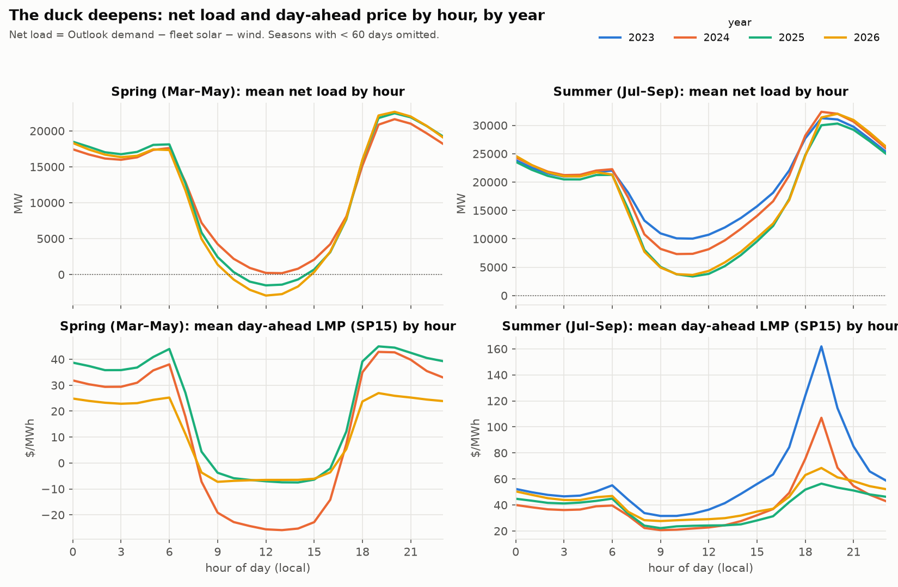
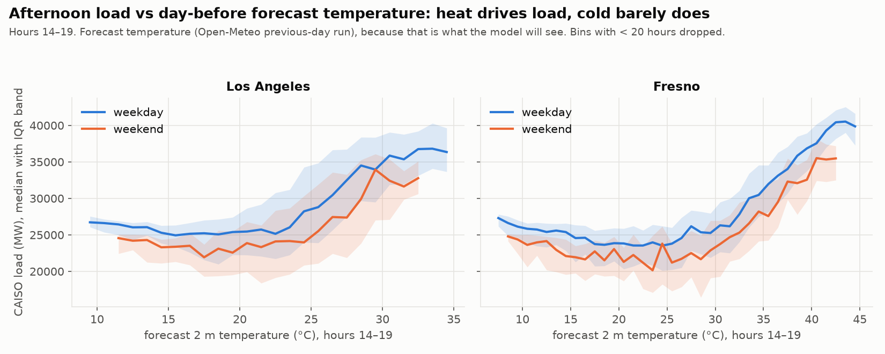
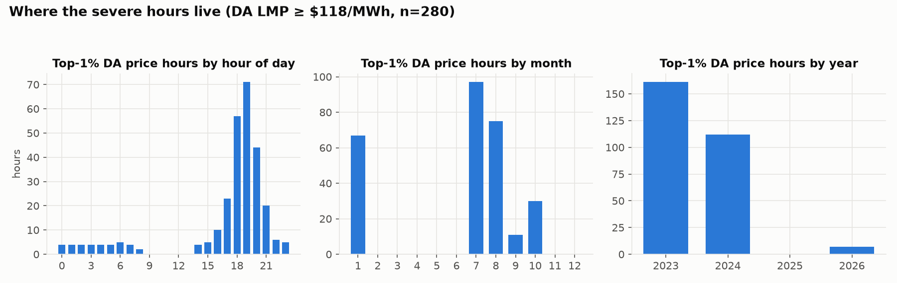
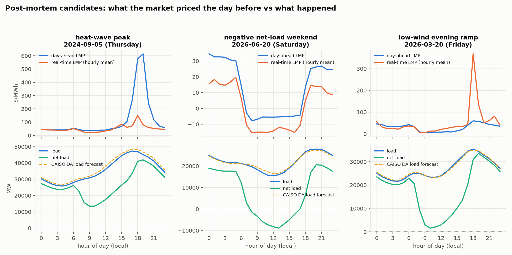

# Phase 2 — EDA findings

Figures in `docs/eda/`, tables in `docs/eda/tables.md` (regenerate with `PYTHONPATH=src python -m caiso_forecast.eda`).

## 1. The duck deepens, and the price duck has flattened

Spring mean net load at the belly: **+0.2 GW (2024) → −1.5 GW (2025) → −2.9 GW (2026)**, about 1.5 GW deeper per
year. Summer belly fell from ~10 GW (2023) to ~3.5 GW (2025–26). Any fitted seasonal shape must therefore be trend-aware;
a model that learns the 2024 midday level is ~3 GW wrong by 2026. This is the non-stationarity the build prompt warns about.

The *price* duck moved the other way. Summer evening mean DA LMP at hour 19: **$162 (2023) → $107 (2024) → $56 (2025) →
$68 (2026)**. Spring midday prices sit at a flat ~−$7 floor in 2025–26 (2024 went to −$25). Severe DA hours (≥ p99 =
$118/MWh) by year: **161, 112, 0, 7**. The market calmed sharply, consistent with the battery build-out absorbing the
evening ramp. Consequences for this project:

- The spike classifier (Phase 8) has very few DA positives after mid-2024. The honest framing is that **spikes migrated
  from day-ahead to real-time**: 2026 still has an RT hourly max of $1,135 and a 15-min max of $1,188.
- The backtest therefore starts **2024-07-01** so the September 2024 heat wave is inside the graded window; 2025 alone
  would make every spike metric vacuous.

## 2. Heat drives load; cold barely does

Afternoon load is flat (~25 GW weekday, ~23 GW weekend) until the forecast temperature passes ~22 °C in LA / ~28 °C in
Fresno, then rises ~1 GW per °C. The weekday/weekend gap is ~2–3 GW and persists at every temperature, so calendar and
temperature are additive, not interchangeable. The temperature used is the day-before forecast run, i.e. what the model
will actually see.

## 3. Where the severe hours live

| regime | hours | DA LMP | RT LMP | load | net load | 3h net-load ramp | solar | fc temp Fresno |
|---|---|---|---|---|---|---|---|---|
| normal (< p95) | 26,539 | $35 | $33 | 23.4 GW | 17.7 GW | −1.4 GW | 0.8 GW | 19 °C |
| spike (p95–p99) | 1,117 | $81 | $76 | 29.5 GW | 25.4 GW | +4.4 GW | ~0 | 30 °C |
| severe (≥ p99) | 280 | $179 | $135 | 37.9 GW | 31.9 GW | **+9.3 GW** | 0.4 GW | **39 °C** |

(medians). Severe hours are an evening phenomenon (hours 17–21, peak at 19), in July–August with a January cluster
(the Jan-2024 western cold snap, a gas-price event). The signature is a 9 GW three-hour net-load ramp after sunset on a
39 °C Fresno day: solar has gone to zero exactly when load peaks. That is what the Phase 8 classifier must key on.

## 4. Post-mortem shortlist (all inside the backtest window)

| event | date | what happened |
|---|---|---|
| Heat-wave peak | **2024-09-05** (Thu) | Load record 47.3 GW. DA priced hour 19 at **$614**; RT settled at $151 (15-min max $328). The market *over*-priced the day-ahead; CAISO's load forecast ran 3.6 % high. |
| Negative net-load weekend | **2026-06-20** (Sat) | Net load −8.9 GW at 13:00 (our definition; CAISO's says −6.9). DA and RT both negative −$5 to −$15 all midday. The ramp from −8.9 GW to +20 GW in five hours. |
| Low-wind evening ramp | **2026-03-20** (Fri) | A quiet-looking day: DA max $60, CAISO load error 1.3 %. RT hit **$368 hourly / $1,188 15-min** at the evening ramp. The miss nobody priced the day before. |

## 5. Cost of the wrong basis
Filled in by `tables.md` once the OASIS `SLD_FCST ACTUAL` series is cached: CAISO's forecast scored against that series
instead of the Outlook demand reads ~7 % MAPE instead of ~2 %. Same forecast, different "actual".
