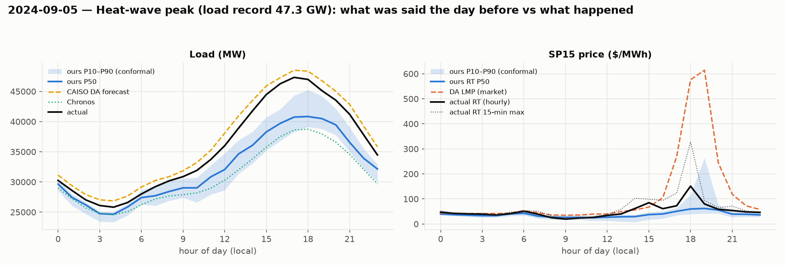

# Post-mortem — 2024-09-05 (Thursday): Heat-wave peak (load record 47.3 GW)

## What the desk had the day before (issued from the 09:00 D-1 origin)

- **Load**: our P50 peak 40,840 MW at 18:00, conformal P10–P90 at that hour 39,117–45,229. CAISO's official DA forecast peak 48,520 MW. Chronos peak 38,739 MW. Seasonal-naive 35,791 MW.
- **Price**: our P50 RT peak $62 at 19:00 (P90 $264); the DA market cleared its peak at $614 at 19:00. Evening-spike probability from the classifier: **0.90**.
- **Inputs that day**: forecast Fresno max 42 °C, LA max 38 °C; CAISO DA solar forecast peak 16,678 MW, evening (17–21) wind forecast mean 1,489 MW; day-before actual peak load 44,290 MW.

## What happened, hour by hour

|   hour_local |   load |   ours P50 |   CAISO DA |   net load |   DA LMP |   RT LMP |   RT 15-min max |   ours RT P50 |
|-------------:|-------:|-----------:|-----------:|-----------:|---------:|---------:|----------------:|--------------:|
|            0 |  30256 |      29655 |      31141 |      27375 |       44 |       47 |              52 |            40 |
|            3 |  26099 |      24748 |      27047 |      23815 |       42 |       39 |              43 |            33 |
|            6 |  28005 |      27415 |      29164 |      26229 |       54 |       51 |              53 |            43 |
|            9 |  30880 |      29024 |      31850 |      13504 |       35 |       20 |              22 |            26 |
|           12 |  36005 |      32060 |      38104 |      17532 |       40 |       34 |              38 |            27 |
|           14 |  41765 |      36070 |      43497 |      23401 |       56 |       62 |             103 |            30 |
|           15 |  44487 |      38292 |      45911 |      26355 |       68 |       85 |              99 |            37 |
|           16 |  46269 |      39706 |      47270 |      29088 |      105 |       61 |              94 |            40 |
|           17 |  47325 |      40748 |      48520 |      33721 |      269 |       73 |             123 |            51 |
|           18 |  46983 |      40840 |      48347 |      41036 |      576 |      151 |             328 |            60 |
|           19 |  45126 |      40498 |      46772 |      41917 |      614 |       80 |              94 |            62 |
|           20 |  43549 |      39470 |      45008 |      40206 |      244 |       59 |              65 |            56 |
|           21 |  41201 |      36558 |      42847 |      37979 |      119 |       54 |              71 |            39 |
|           23 |  34477 |      32146 |      35814 |      31403 |       58 |       46 |              49 |            36 |

Actual peak load 47,325 MW at 17:00; net-load minimum 13,504 MW; 3-hour evening net-load ramp 12,830 MW. RT price peak $151 (hourly) / $328 (15-min) at 18:00.

## Where the band broke

- Load: actual fell outside our conformal P10–P90 in **21 of 24 hours** (hours [1, 2, 3, 4, 5, 8, 9, 10, 11, 12, 13, 14, 15, 16, 17, 18, 19, 20, 21, 22, 23]), worst miss 6,578 MW. CAISO's error on the peak hour was +1,194 MW; ours -6,578 MW.
- Price: actual RT outside our band in **15 of 24 hours** (hours [0, 1, 2, 3, 4, 7, 12, 13, 14, 15, 16, 17, 18, 21, 22]). At the price peak the DA market said $576, we said $60 (P90 $116), actual $151.
- Day MAE: load ours 3,444 MW vs CAISO 1,278 MW vs Chronos 4,669 MW; RT price ours $15 vs DA LMP $67.

## What forward-looking signal would have caught it

The model was **6.6 GW low at the peak** while CAISO was 1.2 GW high. Every input pointed the right way: Fresno forecast 42 °C,
the day-before actual peak already 44.3 GW, the evening-spike classifier at 0.90. The failure is structural, not informational:
a gradient-boosted tree **cannot predict outside the range of its training targets**, and the training set (through 2024-09-03)
had never seen 47 GW. Our P50 flattened at ~40.8 GW, which is where the leaves ran out. Three signals that would have caught it:

1. **Day-before actual peak + forecast temperature delta.** 44.3 GW yesterday and tomorrow forecast 1–2 °C hotter is a one-line
   rule that says "> 45 GW". A linear temperature-response term (or a GBM on *residuals from a linear model*) extrapolates; trees don't.
2. **CAISO's own forecast as a sanity bound** — excluded as a feature on purpose, but a desk would show it next to ours; a 7.7 GW gap
   on a heat-wave day is a flag, not noise.
3. **Price: the DA market priced $614 at 19:00 and RT settled $151.** Here the market over-reacted and our calm $60 P50 was closer in
   dollar terms (day MAE $15 vs DA's $67), but for the wrong reason — the model always says calm. The spike classifier's 0.90 was the
   honest signal that the evening was risky; combining "P(spike)=0.90" with a calm point forecast is the contradiction the desk should act on.
