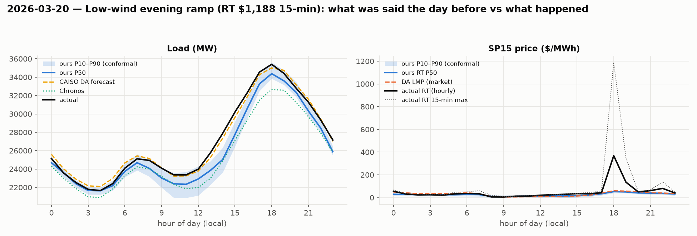

# Post-mortem — 2026-03-20 (Friday): Low-wind evening ramp (RT $1,188 15-min)

## What the desk had the day before (issued from the 09:00 D-1 origin)

- **Load**: our P50 peak 34,377 MW at 18:00, conformal P10–P90 at that hour 33,834–35,597. CAISO's official DA forecast peak 35,008 MW. Chronos peak 32,659 MW. Seasonal-naive 28,139 MW.
- **Price**: our P50 RT peak $53 at 18:00 (P90 $59); the DA market cleared its peak at $60 at 18:00. Evening-spike probability from the classifier: **0.01**.
- **Inputs that day**: forecast Fresno max 35 °C, LA max 33 °C; CAISO DA solar forecast peak 19,877 MW, evening (17–21) wind forecast mean 898 MW; day-before actual peak load 35,202 MW.

## What happened, hour by hour

|   hour_local |   load |   ours P50 |   CAISO DA |   net load |   DA LMP |   RT LMP |   RT 15-min max |   ours RT P50 |
|-------------:|-------:|-----------:|-----------:|-----------:|---------:|---------:|----------------:|--------------:|
|            0 |  25145 |      24683 |      25595 |      23486 |       46 |       56 |              67 |            29 |
|            3 |  21791 |      21666 |      22171 |      20259 |       34 |       25 |              26 |            26 |
|            6 |  24093 |      23747 |      24668 |      22918 |       42 |       36 |              50 |            28 |
|            9 |  24095 |      23022 |      24125 |       2994 |        5 |        6 |              11 |             9 |
|           12 |  23984 |      22915 |      23786 |       2963 |        8 |       20 |              21 |            12 |
|           14 |  27888 |      25034 |      27369 |       7154 |        9 |       29 |              31 |            14 |
|           15 |  30202 |      27756 |      29626 |      10139 |       14 |       35 |              37 |            17 |
|           16 |  32296 |      30577 |      31847 |      13576 |       20 |       34 |              44 |            22 |
|           17 |  34544 |      33262 |      34267 |      20332 |       39 |       42 |              58 |            33 |
|           18 |  35400 |      34377 |      35008 |      30882 |       60 |      368 |            1188 |            53 |
|           19 |  34413 |      33605 |      34743 |      33526 |       57 |      135 |             349 |            50 |
|           20 |  32802 |      32357 |      33164 |      31961 |       52 |       50 |              52 |            41 |
|           21 |  31286 |      30327 |      31604 |      30258 |       43 |       61 |              67 |            40 |
|           23 |  27158 |      25890 |      27014 |      25866 |       35 |       41 |              48 |            32 |

Actual peak load 35,400 MW at 18:00; net-load minimum 1,595 MW; 3-hour evening net-load ramp 19,950 MW. RT price peak $368 (hourly) / $1188 (15-min) at 18:00.

## Where the band broke

- Load: actual fell outside our conformal P10–P90 in **8 of 24 hours** (hours [8, 9, 13, 14, 15, 16, 17, 23]), worst miss 2,854 MW. CAISO's error on the peak hour was -391 MW; ours -1,023 MW.
- Price: actual RT outside our band in **10 of 24 hours** (hours [0, 14, 15, 16, 17, 18, 19, 20, 21, 22]). At the price peak the DA market said $60, we said $53 (P90 $58), actual $368.
- Day MAE: load ours 598 MW vs CAISO 344 MW vs Chronos 1,567 MW; RT price ours $26 vs DA LMP $26.

## What forward-looking signal would have caught it

Nobody priced it: the DA market cleared $60, we said $53 (P90 $61), the spike classifier said 0.01, and real-time hit **$368 for the hour,
$1,188 in one 15-minute interval at 18:00**. Load was unremarkable (CAISO within 400 MW). What the table shows is the ramp:
net load went from **3.0 GW at 12:00 to 30.9 GW at 18:00** — a 28 GW swing in six hours, ~17 GW of it between 16:00 and 19:00 — on a
March day with 19.9 GW of solar, Fresno at 35 °C (10 °C above the seasonal norm) and **evening wind forecast 898 MW**, the bottom
decile. Three forward signals, all available at 09:00 D-1:

1. **Forecast net-load ramp magnitude** (`net_load_proxy_ramp3` on 16→19): the steepest of the year to that date. The classifier had it
   as a feature but had seen almost no March positives (2025 had none), so it could not weight it.
2. **Temperature anomaly vs season**, not temperature level: 35 °C is "normal" in the training set's July rows, extreme for March.
   A `temp_minus_seasonal_normal` feature would separate this day from a routine summer afternoon.
3. **Evening wind in the bottom decile + solar in the top decile for the month** — a two-variable rule that flags the ramp without
   any price history at all. This is the day that argues for a *regime* label (ramp steepness) rather than a dollar-threshold label.

Verdict: a textbook structural miss. The DA–RT spread was the whole value that day and no history-based model — ours, Chronos, or
the market — had a reason to expect it from the price series alone.
