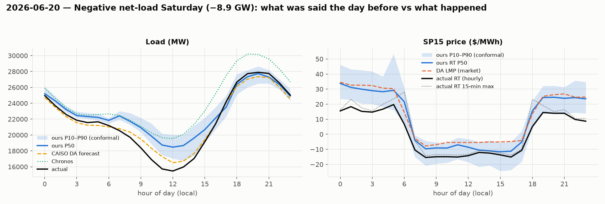

# Post-mortem — 2026-06-20 (Saturday): Negative net-load Saturday (−8.9 GW)

## What the desk had the day before (issued from the 09:00 D-1 origin)

- **Load**: our P50 peak 27,734 MW at 20:00, conformal P10–P90 at that hour 26,478–28,648. CAISO's official DA forecast peak 27,359 MW. Chronos peak 30,204 MW. Seasonal-naive 34,454 MW.
- **Price**: our P50 RT peak $34 at 00:00 (P90 $53); the DA market cleared its peak at $35 at 00:00. Evening-spike probability from the classifier: **0.00**.
- **Inputs that day**: forecast Fresno max 32 °C, LA max 23 °C; CAISO DA solar forecast peak 20,198 MW, evening (17–21) wind forecast mean 4,398 MW; day-before actual peak load 29,374 MW.

## What happened, hour by hour

|   hour_local |   load |   ours P50 |   CAISO DA |   net load |   DA LMP |   RT LMP |   RT 15-min max |   ours RT P50 |
|-------------:|-------:|-----------:|-----------:|-----------:|---------:|---------:|----------------:|--------------:|
|            0 |  24971 |      25211 |      24716 |      18994 |       35 |       16 |              16 |            34 |
|            3 |  21860 |      22457 |      21545 |      17637 |       32 |       15 |              16 |            29 |
|            6 |  21194 |      21845 |      21025 |      12435 |       15 |        7 |              28 |            22 |
|            9 |  18394 |      20931 |      19494 |      -3351 |       -7 |      -15 |             -13 |            -9 |
|           12 |  15464 |      18476 |      16512 |      -8190 |       -5 |      -14 |             -13 |            -9 |
|           14 |  17047 |      19629 |      17691 |      -6954 |       -5 |      -12 |             -11 |           -11 |
|           15 |  19150 |      20685 |      19422 |      -4986 |       -5 |      -14 |             -13 |           -12 |
|           16 |  21382 |      22125 |      21354 |      -2344 |       -5 |      -15 |             -14 |           -11 |
|           17 |  24194 |      23510 |      24107 |         36 |       -4 |      -11 |             -10 |            -5 |
|           18 |  26675 |      26393 |      26117 |       6444 |       14 |        5 |              23 |            16 |
|           19 |  27730 |      27342 |      27048 |      17079 |       25 |       15 |              19 |            24 |
|           20 |  27895 |      27734 |      27359 |      20607 |       26 |       14 |              15 |            25 |
|           21 |  27756 |      27295 |      27221 |      20419 |       27 |       14 |              16 |            24 |
|           23 |  25031 |      24911 |      24543 |      17621 |       25 |        9 |              10 |            24 |

Actual peak load 27,895 MW at 20:00; net-load minimum -8,852 MW; 3-hour evening net-load ramp 19,423 MW. RT price peak $20 (hourly) / $28 (15-min) at 05:00.

## Where the band broke

- Load: actual fell outside our conformal P10–P90 in **14 of 24 hours** (hours [1, 2, 3, 4, 5, 6, 7, 8, 9, 10, 11, 12, 13, 14]), worst miss 3,012 MW. CAISO's error on the peak hour was -536 MW; ours -161 MW.
- Price: actual RT outside our band in **8 of 24 hours** (hours [0, 1, 2, 3, 4, 6, 22, 23]). At the price peak the DA market said $30, we said $29 (P90 $53), actual $20.
- Day MAE: load ours 1,067 MW vs CAISO 547 MW vs Chronos 2,376 MW; RT price ours $8 vs DA LMP $11.

## What forward-looking signal would have caught it

This one the forecasts got right: load within 400 MW of CAISO, both inside 1.5 % of actual at the peak, and prices negative all
midday exactly as the DA market cleared. The band breaks are in the **overnight and morning hours**, where actual load ran below
our P10 — a Saturday-after-a-hot-week effect (the day before peaked at 29.4 GW) that the lag features carried into the small hours.
The forward-looking signals were all in CAISO's DA renewables forecast, published 07:00 D-1: solar 20.2 GW and 4.4 GW of evening
wind on a mild (LA 23 °C) Saturday means the system must shed ~9 GW at noon. The useful product here isn't a better point forecast,
it's the **net-load forecast** itself: `net_load_proxy` (last week's load shape minus tomorrow's renewables) said negative at 10–14,
which is the whole story for a battery (charge at −$15, discharge at the 20 GW evening ramp).
